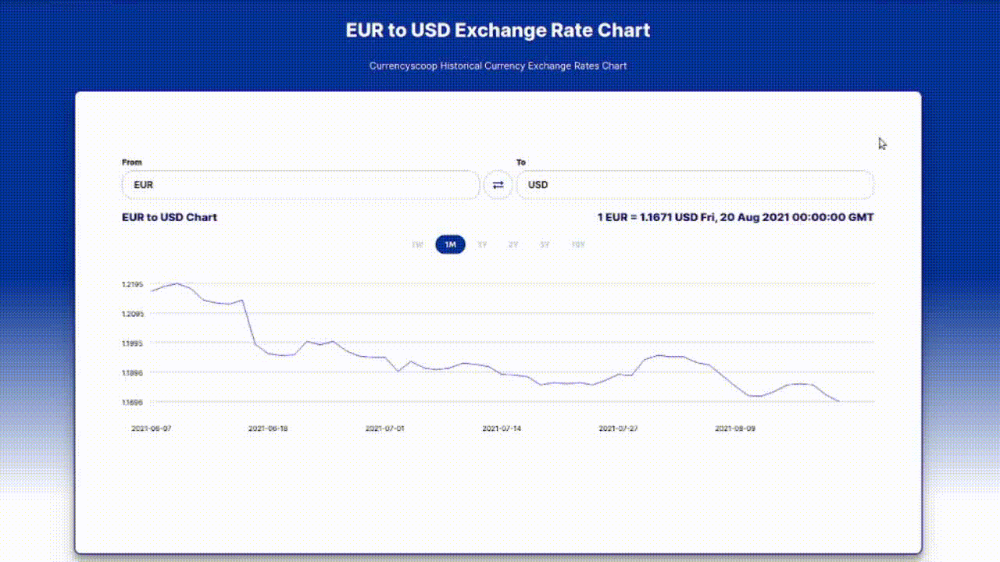
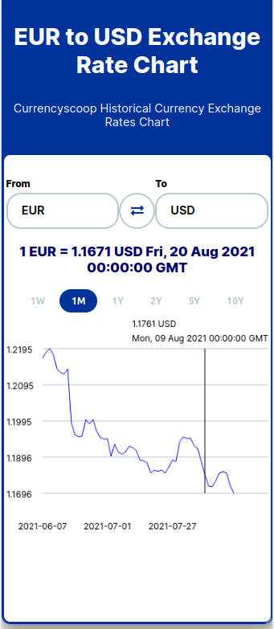

# Currency Graph

Web application which implements Frankfurter API (https://www.frankfurter.app). This application shows current and historical foreign exchange rates on a graph
with an ability to choose which currencies you want to look at and different time spans.

## Purpose
The purpose of this project was to increase JavaScript programming competence and practice integrating third-party APIs.

## Demo
This project is hosted on github pages: https://jusrus01.github.io/CurrencyGraph

## Application usage overview

### Mobile version

